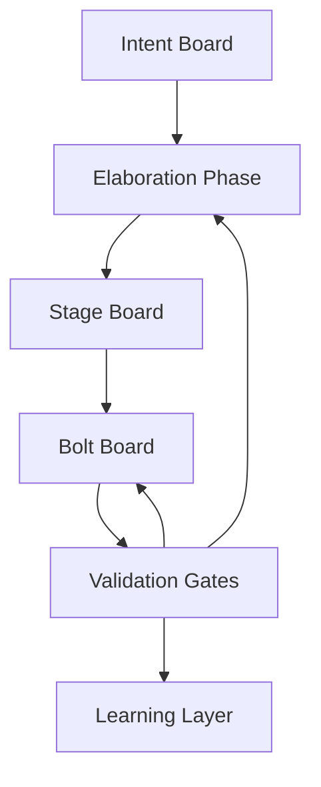

# Nethra Data Explorer

## Concept

Nethra Data Explorer is an agentic, explainable data intelligence platform.

Users import a dataset, and the system:
- understands schema and ontology
- builds the interface dynamically
- discovers patterns and runs statistics
- explains findings with evidence
- supports expert knowledge enrichment
- generates reports
- runs locally in containers first
- later deploys to Azure

The first domain is poverty tracking, but the structure is designed for other domains without creating one custom page per dataset.

## AI-DLC Operating Model

## Intent Structure

- Product Intent
- Business Intent
- User Intent
- Functional Intent
- Non-Functional Intent
- Architecture Intent
- Delivery Intent

## MVP Stages

### Stage 1: Data Onboard and Schema
- Architecture Bolt
- Foundation Bolt
- Import Bolt

### Stage 2: Generated UI and Charts
- Interface Bolt
- Visualization Bolt

### Stage 3: Basic Analysis and Explainability
- Pattern Bolt
- Explainability Bolt

### Stage 4: Testable Report and Polish
- Statistics Bolt
- Conversation Bolt
- Reasoning Bolt
- Narrative Bolt
- Workspace Bolt
- Delivery Bolt

## MVP Execution Loop

Intent -> Elaboration -> Stage Selection -> Bolt Decomposition -> Unit Elaboration -> Agent Execution -> Agent Testing -> Human Validation -> Commit / PR / Merge -> Learning Log -> Next Intent

## Reference Assets

- [Logical Architecture Image](./logical-architecture.png)
- [AI-DLC Operating Model](./operating-model.md)
- [MVP Bolt Catalog](./mvp-bolts.md)
